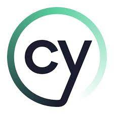

# commercial-tech-QA-test

# Interview schedule

* Introduction.
* 45 minutes to complete the challenge.
* Review the challenge and other potential solutions.
* Questions.
* Wrap up.

# Setup

This is a basic cypress setup .It is ready to writing your tests.

1. Make sure you're using node v18.16.1 or greater. If you have `nvm` setup then feel free to run `nvm use`.
2. Run `npm i`
3. Run `npx cypress open` - this will open cypress ui

https://www.cypress.io/blog/2020/02/12/working-with-iframes-in-cypress

# QA Test

Candidate is require to do cypress  typescript/ javascript  test 

Scenario:

1. Visit - https://www.thesun.co.uk/sport/26213764/ten-hag-jamie-carragher-man-utd-sky-sports/
2. Check network request :  gampad/ads
3. Extract request body 
4. Extract  correlator
5. Check if the correlator  is same in  all  gampad/ads  requests

Test will be evaluated based on :
     Expected results,
     Approach,
     Coding standards,
     Behavior.

Candidate can use IDE of choice and need to do screen share  during test 

Manual Steps

     1 Visit the url (Incognito): https://www.thesun.co.uk/sport/26213764/ten-hag-jamie-carragher-man-utd-sky-sports/
     2 Accept the cookies -> mandatory to proceed
     3 Wait for the page to fully load 
     4 Open developer tool and look for network request
     4 Look for any requests with partial match of 'gampad/ads', this could be 1 or more requests
     5 Extract  payload / body of the request 
     6 then  extract the correlator id  present in the request
     7 Assert that the correlator is same in all 'gampad/ads' available request 
       for the partial match of  'gampad/ads'